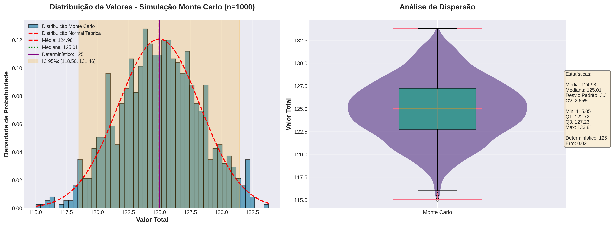
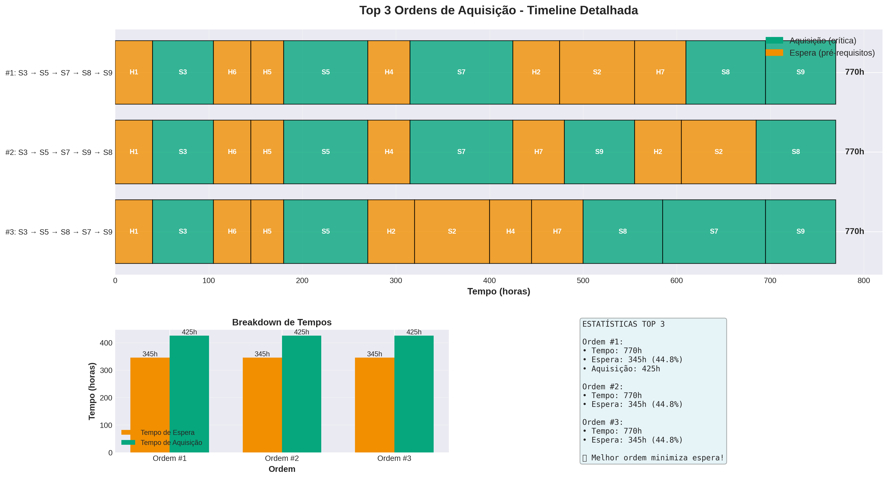
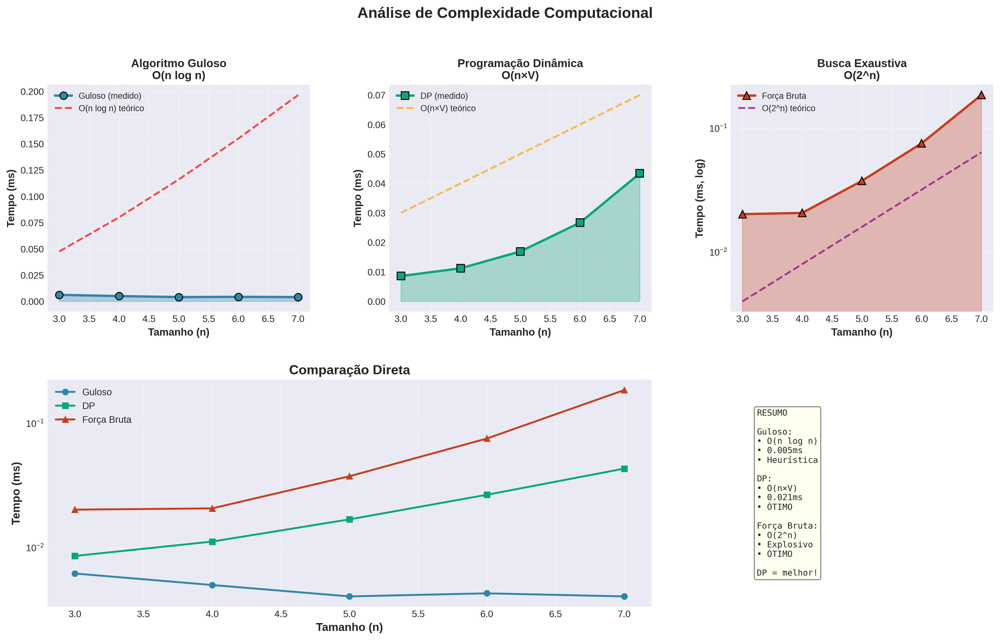
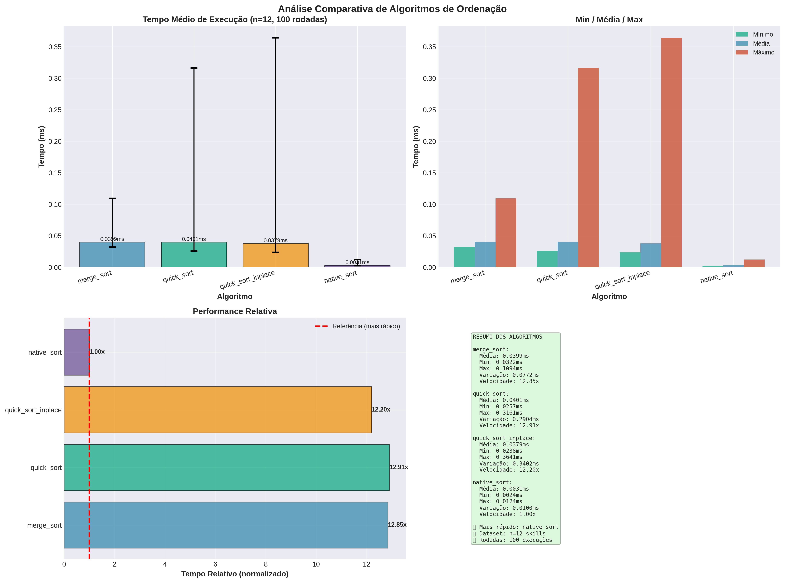
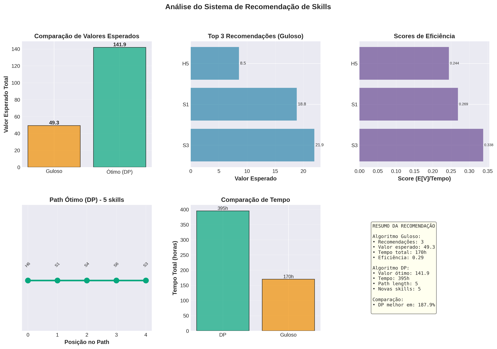

# 🌍 Global Solution - Motor de Orientação de Habilidades (MOH)

## 👥 Equipe

### Desenvolvedores

| Nome                              | RM            |
| --------------------------------- | ------------- |
| **Isabelle Dallabeneta Carlesso** | **RM 554592** |
| **Nicoli Amy Kassa**              | **RM 559104** |

**Curso:** Engenharia de Software

**Disciplina:** Dynamic Programming

**Professor:** André Marques

**Tema:** O Futuro do Trabalho

## 📋 Índice

- [Visão Geral](#visão-geral)
- [Estrutura do Projeto](#estrutura-do-projeto)
- [Desafios Implementados](#desafios-implementados)
- [Requisitos](#requisitos)
- [Instalação](#instalação)
- [Como Usar](#como-usar)
- [Testes](#testes)
- [Visualizações](#visualizações)
- [Algoritmos e Complexidade](#algoritmos-e-complexidade)

## 🎓 Visão Geral

O **Motor de Orientação de Habilidades (MOH)** é um sistema inteligente desenvolvido para otimizar trajetórias de aprendizado em tecnologia. Utilizando algoritmos avançados de otimização, o sistema analisa 12 habilidades técnicas interconectadas e recomenda caminhos personalizados baseados em:

- **Valor de mercado** das habilidades
- **Tempo de aquisição**
- **Complexidade técnica**
- **Dependências** entre habilidades
- **Cenários futuros** de mercado

### 🎯 Objetivos

1. Maximizar o valor esperado das habilidades adquiridas
2. Respeitar restrições de tempo e complexidade
3. Considerar pré-requisitos e dependências
4. Fornecer análises preditivas com simulações Monte Carlo
5. Adaptar-se a diferentes perfis e horizontes temporais

## 📁 Estrutura do Projeto

```
GS2_DP_MOH/
├── GS2_DP.ipynb                 # Notebook
├── main.py                      # Ponto de entrada principal
|
├──src
|   ├── gs_config.py                 # Configurações globais e database
|   ├── gs_input_file.py             # Arquivo de entrada de dados
|   ├── gs_graph_validation.py       # Validação de integridade do grafo
|   ├── gs_challenge1.py             # Desafio 1: Caminho de Valor Máximo
|   ├── gs_challenge2.py             # Desafio 2: Verificação Crítica
|   ├── gs_challenge3.py             # Desafio 3: Pivô Mais Rápido
|   ├── gs_challenge4.py             # Desafio 4: Trilhas Paralelas
|   ├── gs_challenge5.py             # Desafio 5: Recomendação de Habilidades
|   ├── gs_visualization.py          # Módulo de visualizações profissionais
|   ├── gs_fix_visualization.py      # Correções de visualização
|   └── gs_tests.py                  # Suite de testes completa
│
└── README.md                    # Este arquivo
```

## 🚀 Como Usar Utilizando o Notebook (GS2_DP.ipynb)

- O notebook pode ser visualizado pelo próprio github
- Caso queira usar o colab, siga os passo abaixo:
  1. Baixar todos os arquivos `.py` exceto o `main.py`
  2. Abrir o arquivo `GS2_DP.ipynb` no Google Colab
  3. Importar todos os outros arquivos `.py`
  4. Executar `GS2_DP.ipynb`

## 🚀 Como Usar Utilizando o `main.py`

### 🔧 Requisitos

#### Dependências Principais

```txt
Python >= 3.8
numpy >= 1.20.0
matplotlib >= 3.3.0
```

#### Dependências Opcionais

```txt
seaborn >= 0.11.0  # Visualizações aprimoradas
jupyter >= 1.0.0   # Ambiente interativo
```

### 📥 Instalação

#### 1. Clone o repositório

```bash
git clone https://github.com/seu-usuario/global-solution-moh.git
cd global-solution-moh
```

#### 2. Crie um ambiente virtual (recomendado)

```bash
# Linux/Mac
python3 -m venv venv
source venv/bin/activate

# Windows
python -m venv venv
venv\Scripts\activate
```

#### 3. Instale as dependências

```bash
pip install numpy matplotlib

# Opcional: para gráficos aprimorados
pip install seaborn
```

### Execute todos os desafios sequencialmente:

```bash
python main.py
```

### Execução Individual

Execute desafios específicos:

```bash
# Desafio 1
python gs_challenge1.py

# Desafio 2
python gs_challenge2.py

# Desafio 3
python gs_challenge3.py

# Desafio 4
python gs_challenge4.py

# Desafio 5
python gs_challenge5.py
```

### Visualizações

Gere gráficos profissionais:

```python
from gs_visualization import ImprovedVisualization

# Exemplo: Gráfico Monte Carlo
viz = ImprovedVisualization()
viz.plot_monte_carlo_enhanced(
    simulations=monte_carlo_results,
    deterministic_value=1234.5,
    show=True
)
```

## 🏆 Desafios Implementados

### Desafio 1️⃣: Caminho de Valor Máximo

**Objetivo:** Encontrar a sequência de habilidades que maximize o valor esperado até S6 (IA Generativa), respeitando:

- Tempo máximo: 350 horas
- Complexidade acumulada: ≤ 30

**Técnicas:**

- Programação Dinâmica (DP) multidimensional (knapsack 2D)
- Simulação Monte Carlo (1000 cenários)
- Análise de incerteza com valores variantes

**Complexidade:** O(n × T × C) onde:

- n = número de habilidades
- T = tempo máximo
- C = complexidade máxima

---

### Desafio 2️⃣: Verificação Crítica

**Objetivo:** Analisar as 5 habilidades críticas (S3, S5, S7, S8, S9), enumerar 120 permutações e encontrar a ordem ótima.

**Técnicas:**

- Validação de grafo (detecção de ciclos)
- Força bruta com todas as permutações (5! = 120)
- Cálculo de tempo de espera por pré-requisitos
- Análise estatística das top 3 ordens

**Complexidade:** O(n! × n) para n=5 habilidades

---

### Desafio 3️⃣: Pivô Mais Rápido

**Objetivo:** Alcançar adaptabilidade mínima (S ≥ 15) usando apenas habilidades básicas sem pré-requisitos.

**Técnicas:**

- Algoritmo Guloso (seleção por razão Valor/Tempo)
- Programação Dinâmica (solução ótima)
- Busca exaustiva (contraexemplo)
- Análise empírica de complexidade

**Complexidade:**

- Guloso: O(n log n)
- DP: O(n × S) onde S = adaptabilidade alvo
- Força Bruta: O(2^n)

---

### Desafio 4️⃣: Trilhas Paralelas

**Objetivo:** Ordenar 12 habilidades por complexidade e dividir em 2 sprints (Sprint A: 1-6, Sprint B: 7-12).

**Algoritmos Implementados:**

- **Merge Sort** (escolha principal)
  - Complexidade: O(n log n) garantido
  - Estável e previsível
- **Quick Sort** (comparação)
  - Complexidade média: O(n log n)
  - Pior caso: O(n²)
- **Sort nativo Python** (baseline)

**Complexidade:** O(n log n) para todos os casos com Merge Sort

---

### Desafio 5️⃣: Recomendação de Habilidades

**Objetivo:** Recomendar 2-3 próximas habilidades maximizando valor esperado em horizonte de 5 anos.

**Técnicas:**

- Programação Dinâmica com horizonte finito
- Cenários de mercado ponderados por probabilidade:
  - AI_Boom (40%)
  - Cloud_Native (35%)
  - Security_First (25%)
- Fator de desconto temporal (0.95/ano)
- Comparação Guloso vs DP

**Complexidade:** O(T × 2^n × n) onde T = horizonte em horas

## 🧪 Testes

### Executar Suite Completa de Testes

```bash
python gs_tests.py
```

### Testes Incluídos

✅ **Validação de Entrada**

- Integridade do database de habilidades
- Validação de pré-requisitos
- Detecção de ciclos

✅ **Teste de Desafios**

- Desafio 1: Caminho ótimo encontrado
- Desafio 2: Top 3 ordens válidas
- Desafio 3: Solução ótima vs Gulosa
- Desafio 4: Ordenação correta
- Desafio 5: Recomendações válidas

✅ **Teste de Performance**

- Benchmark de algoritmos
- Análise de complexidade
- Tempo de execução

### Exemplo de Saída de Testes

```
================================================================================
                    🧪 GLOBAL SOLUTION 2 - SUITE DE TESTES 🧪
================================================================================

📋 Validando gs_input_file.py...
✅ Módulo gs_input_file.py importado com sucesso
✅ Database validado com sucesso!

📊 Estatísticas:
   Total de skills: 12
   Skills básicas: 3
   Skills críticas: 5

🧪 Executando testes dos desafios...
✅ Desafio 1: PASSOU
✅ Desafio 2: PASSOU
✅ Desafio 3: PASSOU
✅ Desafio 4: PASSOU
✅ Desafio 5: PASSOU

📊 RESUMO FINAL:
   ✅ 5/5 testes passaram (100.0%)
   ⏱️ Tempo total: 12.34s
```

## 📊 Visualizações

O sistema gera gráficos de alta qualidade salvos automaticamente:

### Desafio 1

- `desafio1_monte_carlo_enhanced.png` - Análise Monte Carlo com distribuição normal

### Desafio 2

- `desafio2_top3_enhanced.png` - Timeline das top 3 ordens de aquisição

### Desafio 3

- `desafio3_complexity_enhanced.png` - Comparação de complexidade algorítmica

### Desafio 4

- `desafio4_sorting_comparison.png` - Benchmark de algoritmos de ordenação

### Desafio 5

- `desafio5_recommendation_analysis.png` - Análise do sistema de recomendação

## Gráficos

### **Análise Monte Carlo (Desafio 1)**



### **Timeline Top 3 (Desafio 2)**



### **Complexidade Computacional (Desafio 3)**



### **Benchmark de algoritmos de ordenação (Desafio 4)**



### **Análise do sistema de recomendação (Desafio 5)**



## 🔬 Algoritmos e Complexidade

### Resumo por Desafio

| Desafio | Algoritmo Principal | Complexidade   | Observações              |
| ------- | ------------------- | -------------- | ------------------------ |
| 1       | DP Knapsack 2D      | O(n × T × C)   | Ótimo, Monte Carlo       |
| 2       | Força Bruta         | O(n! × n)      | Validação de grafo       |
| 3       | DP (Knapsack 1D)    | O(n × S)       | Guloso como baseline     |
| 4       | Merge Sort          | O(n log n)     | Estável, garantido       |
| 5       | DP Horizonte Finito | O(T × 2^n × n) | Cenários probabilísticos |

### Comparação de Abordagens

#### Programação Dinâmica vs Guloso

**Quando usar DP:**

- Solução ótima é necessária
- Subproblemas sobrepostos
- Restrições múltiplas

**Quando usar Guloso:**

- Solução aproximada aceitável
- Performance crítica
- Propriedade de escolha gulosa válida

## 📈 Database de Habilidades

### Habilidades Básicas (sem pré-requisitos)

| ID  | Nome          | Valor | Tempo | Complexidade |
| --- | ------------- | ----- | ----- | ------------ |
| H1  | Python Básico | 70    | 40h   | 2            |
| H2  | SQL Essencial | 65    | 35h   | 2            |
| H3  | Git/GitHub    | 60    | 25h   | 1            |

### Habilidades Seniores (S)

| ID  | Nome                   | Valor | Tempo | Complexidade | Pré-requisitos |
| --- | ---------------------- | ----- | ----- | ------------ | -------------- |
| S1  | Data Science           | 100   | 50h   | 4            | H1, H2         |
| S2  | Web Scraping           | 75    | 30h   | 3            | H1             |
| S3  | Análise Dados Avançada | 90    | 45h   | 4            | S1             |
| S4  | Machine Learning       | 110   | 60h   | 5            | S1             |
| S5  | Cybersecurity          | 95    | 55h   | 5            | H3, S2         |
| S6  | IA Generativa          | 120   | 70h   | 6            | S4             |
| S7  | Cloud Computing        | 100   | 50h   | 4            | H3             |
| S8  | APIs REST              | 80    | 40h   | 3            | H1, S7         |
| S9  | DevOps                 | 105   | 65h   | 5            | H3, S7, S8     |

### Habilidades Híbridas (H)

| ID  | Nome       | Valor | Tempo | Complexidade | Pré-requisitos |
| --- | ---------- | ----- | ----- | ------------ | -------------- |
| H11 | Big Data   | 85    | 50h   | 4            | S1, S4         |
| H12 | Blockchain | 90    | 55h   | 5            | S5, S8         |

## 🎨 Customização

### Modificar Database de Habilidades

Edite `gs_config.py`:

```python
SKILLS_DATABASE = {
    'NEW_SKILL': {
        'Nome': 'Nova Habilidade',
        'Valor': 100,
        'Tempo': 50,
        'Complexidade': 4,
        'Pre_Reqs': ['H1', 'H2'],
        'Categoria': 'Sênior'
    }
}
```

### Ajustar Parâmetros

```python
# gs_config.py
MAX_TIME = 350          # Tempo máximo (horas)
MAX_COMPLEXITY = 30     # Complexidade máxima
MIN_ADAPTABILITY = 15   # Adaptabilidade mínima
N_MONTE_CARLO = 1000    # Simulações Monte Carlo
```

### Customizar Visualizações

```python
# gs_visualization.py
COLORS = {
    'primary': '#2E86AB',    # Azul
    'success': '#06A77D',    # Verde
    'warning': '#F18F01',    # Laranja
    # ... customize cores
}
```
